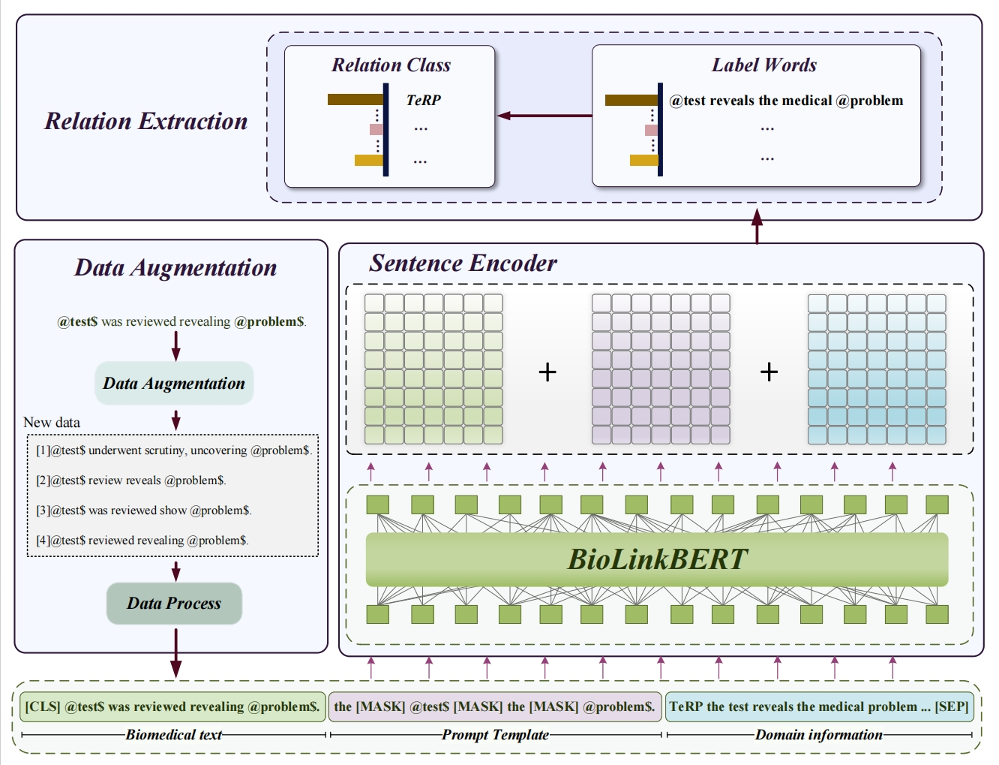

# FewPL
### model
<p align="center">
  
</p>


```
- Schematic diagram of the proposed few-shot biomedical relation extraction method. Starting from biomedical text, the data augmentation module enriches the training corpus by generating new text variants. This data, combined with customized prompt template and domain information, is then directed into a sentence encoder module to generate a vector representation of the input. The final stage involves the relation extraction module, which determines the relation class between texts through the predicted label words at the [MASK] position.
```

## 1. Environments

```
- python==3.8
- cuda==11.3
```

## 2. Dependencies

```
- numpy==1.18.0
- scikit-learn==0.22.1
- scipy==1.4.1
- tqdm==4.41.1
- transformers==4.0.0
- torch==1.10.0
- pandas==1.3.4
- scikit-learn==1.0.1
```

## 3. Dataset

Here we provide the processed I2B2-2010RE,DDI,ChemProt dataset

```
- Generate K-shot data   python generate_k_shot.py 

```

## 4. Data Augmentation Module

```
- Go to folder   cd DA 
- Augmentation using GPT API    ---python GPTDA.py
- Augmentation using Google Translate API   ---python TranDA.py
- Augmentation using SynonymAug    ---python SynonymDA.py
- Augmentation using RandomWordAug     ---python RandomWordAugDA.py

```


## 5. Training and Evaluate

```bash
- sh I2B2-2010RE_few.sh
- sh DDI_few.sh
- sh ChemProt_few.sh
